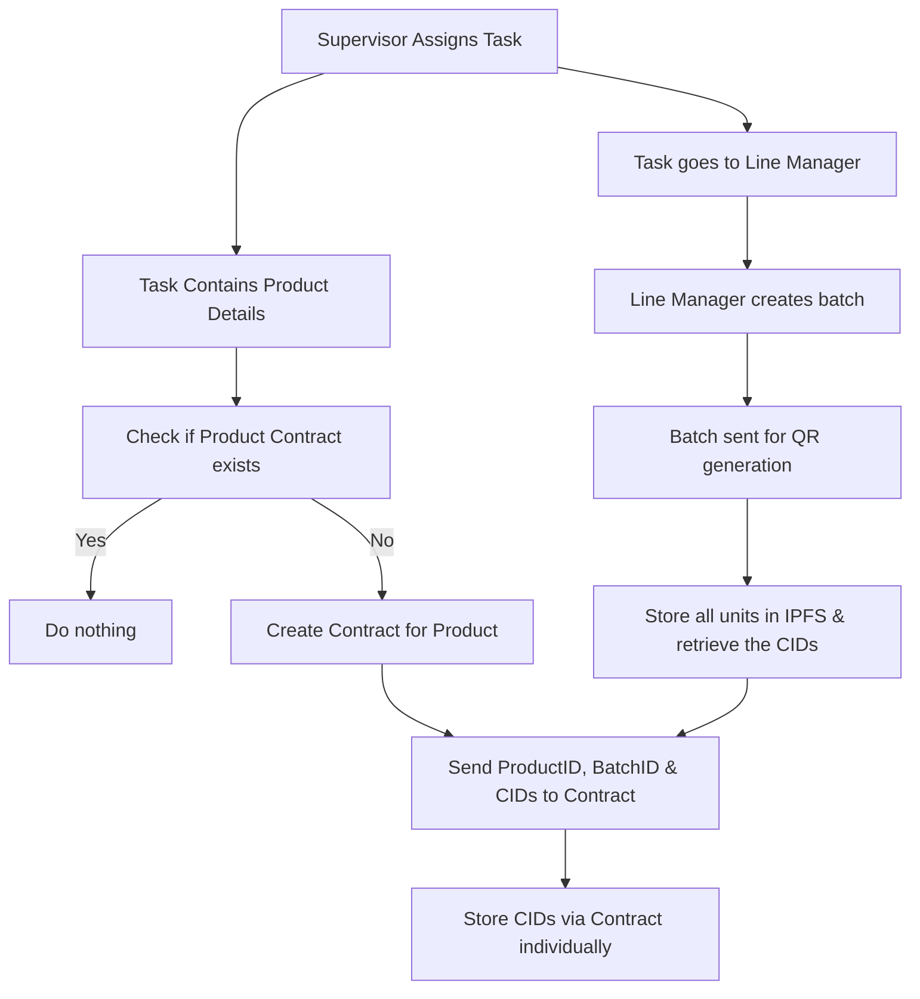

# Contract Based Approach

This approach leverages Hedera Smart Contracts to store and manage the IPFS CIDs of our products. Instead of minting NFTs & embedding metadata, we use a contract as a decentralized registry where each product batch or unit can have its corresponding CID recorded permanently on-chain. The main motivation here is that smart contracts provide flexibility & programmability we can implement access control, validation, versioning & batch storage logic within the contract.

Similar to the NFT approach, we can only send about 10 urls at a time to the contract as more than 10 seem to cause parameter errors. Therefore for the purpose of maintaining a working system we will not be going above this limit untill we are sure of what's causing this error which will require further testing.

This approach is significantly cheaper than the NFT based approach however in its current state lacks the ability to Track the product's journey (i.e supply chain). Currently the main focus of this approach is to create a cheap, fast prototype similar to current one. Each product class has its own contract that will store its unit information that will be used for verification.

The entire pipeline for storing & verifying products information is already implemented along with a standalone API for auto deployment & verification of new contracts which will also be integrated (but hasn't been as me writing this change).

So all things considered so far here are the statistics for this approach.

1. Each Contract transaction costs about Rs 2.5 which comes out to Rs 0.25 for each product stored
2. Using our testnet HBar allow us to store 84,747 urls per day per account (no cost)
3. The largest batch was of 500 products which took 2.35 mins

