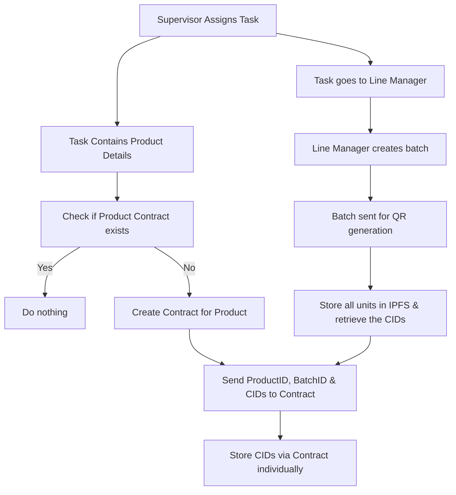

# Contract Based Approach

This approach leverages Hedera Smart Contracts to store and manage the IPFS CIDs of our products. Instead of minting NFTs & embedding metadata, we use a contract as a decentralized registry where each product batch or unit can have its corresponding CID recorded permanently on-chain.

The main motivation here is that smart contracts provide flexibility & programmability we can implement access control, validation, versioning, and batch storage logic within the contract. This ensures more granular governance compared to NFTs, where metadata is static after minting.

