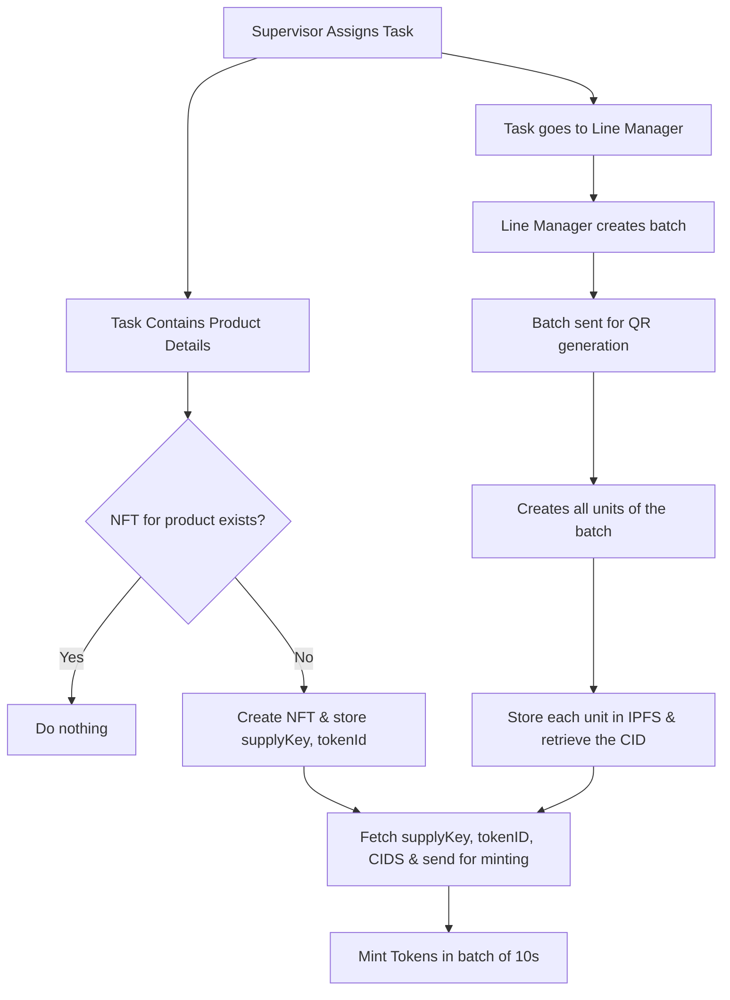

# Token Based Approach
This approach is to use Hedera NFTs to store the IPFS CIDs of our products, since Hedera has the cheapest NFT prices & does not have a rate limit for requests. *however there are Throttles to TPS, which will be discussed later in this document*

The plan is to use NFT's metadata to store the IPFS CID through minting, each token would represent a product with the CID in its metadata being used in our verification process.

Basically we will have these NFTs created/initialized when the supervisor creates a task for a new product. we will then store the token's suppleKey & tokenID, _important for identification & minting_. Once the Line manager send a batch for QR generation, we will retrieve these parameters inorder to mint our tokens.

The network allows us to minting 10 NFTs in a single transaction & there is a 50 TPS limit for each network. This means a theoretical limit of 500 NFTs each second but we will not push it to this theoretical limit as the documentation is still vague on it.

So all things considered so far here are the statistics for this approach.

1. Each NFT costs about $0.02 which is Rs 1.74
2. Using our testnet HBar allow us to mint 13,580 per day per account (no cost)
3. The largest batch was of 400 products which took 1.39 mins



# Information About Hedera Tokens
## FETCHING METADATA 
To check if a specific IPFS URL exists in the metadata of any of your NFTs, you need to:

1. **Retrieve the metadata for each NFT**:  
   - On Hedera, the NFT's metadata field typically contains a CID (Content Identifier) pointing to a JSON file on IPFS.
   - You can fetch this metadata by resolving the CID (e.g., using `https://ipfs.io/ipfs/<CID>`).

2. **Parse the metadata JSON**:  
   - Download and parse the JSON file for each NFT.
   - The metadata will usually have fields like `image`, `files`, or other custom properties that may contain URLs.

3. **Search for the specific URL**:  
   - For each metadata JSON, check if your target URL matches any value in the relevant fields.

### Example Approach

Suppose you have a list of NFT CIDs:

```js
const nftCids = [
  "bafyreiao6ajgsfji6qsgbqwdtjdu5gmul7tv2v3pd6kjgcw5o65b2ogst4",
  "bafyreic463uarchq4mlufp7pvfkfut7zeqsqmn3b2x3jjxwcjqx6b5pk7q",
  // ... more CIDs
];

const targetUrl = "ipfs://QmSomeHashForThePhoto";

async function checkUrlInMetadata(cids, url) {
  for (const cid of cids) {
    const response = await fetch(`https://ipfs.io/ipfs/${cid}/metadata.json`);
    const metadata = await response.json();

    // Check common fields
    if (
      metadata.image === url ||
      (metadata.files && metadata.files.some(f => f.uri === url))
    ) {
      return true; // Found the URL
    }
  }
  return false; // Not found
}
```

This function fetches each metadata file, parses it, and checks if the target URL exists in the `image` field or within the `files` array (as per [HIP-412](https://github.com/hashgraph/hedera-improvement-proposal/blob/main/HIP/hip-412.md#default-schema-collectibe-hedera-nfts-format-hip412100)).

### Notes

- If you have a large number of NFTs, consider batching or parallelizing requests.
- The structure of your metadata should follow the [HIP-412 standard](https://hedera.com/blog/hedera-nft-metadata-hip412), so look for URLs in the `image`, `files`, or custom fields as appropriate.
- If your NFTs are on Hedera, you can use explorers or SDKs to programmatically retrieve the metadata CIDs from the ledger, then proceed as above.

This approach is based on how NFT metadata is structured and accessed on Hedera, as described in the official documentation and blog posts [Hedera NFT Metadata HIP412](https://hedera.com/blog/hedera-nft-metadata-hip412), [NFT Storage: Why it Matters](https://hedera.com/blog/nft-storage-why-it-matters), and [Token Metadata JSON Schema V2](https://docs.hedera.com/hedera/tutorials/token/structure-your-token-metadata-using-json-schema-v2#putting-things-together).

There is no built-in, highly efficient on-chain way to search for a specific IPFS URL across all NFT metadata on Hedera. The standard approach is to fetch each NFT’s metadata individually and check for the URL, as described previously. This is because, on Hedera, the metadata is stored off-chain (e.g., on IPFS), and the ledger only stores a pointer (the CID or URL) to that metadata. There is no global index of metadata contents on-chain that you can query directly for a specific value.

However, there are some ways to make this process more efficient:

- **Off-chain Indexing:**  
  You can build or use an off-chain indexer that periodically fetches and indexes all NFT metadata for your collection. This allows you to perform fast searches locally or via a database, rather than querying each NFT individually every time. This is the approach used by NFT explorers and platforms, and is mentioned as a best practice for advanced filtering and search scenarios. For example, the Guardian Global Indexer is designed to enhance data search and retrieval across datasets, including integration with Hedera and IPFS, to support efficient queries across large datasets [Global Indexer](https://docs.hedera.com/guardian/guardian/global-indexer).

- **Custom Smart Contract Indexing:**  
  If you control the minting contract, you could store a mapping or index of URLs on-chain as you mint NFTs. This would allow for efficient lookups, but increases on-chain storage costs and complexity. The Hedera blog on modeling building metadata shows an example of storing and filtering metadata on-chain, but notes that for real-world use, off-chain indexing is usually required for efficiency [How can we model a building in web3](https://hedera.com/blog/how-can-we-model-a-building-in-web3).

- **Use of NFT Studio Tools:**  
  Tools like the NFT Studio Metadata Validator and Rarity Inspector can help you process and analyze metadata in bulk, but they are designed for validation and rarity analysis, not for arbitrary URL search. Still, you could use these tools to export and process metadata more efficiently [NFT Studio Tools](https://docs.hedera.com/hedera/open-source-solutions/nft-studio#overview-of-the-nft-studio-tools).

**Summary:**  
The most efficient way is to maintain your own off-chain index of NFT metadata, or use a third-party indexer if available. On-chain or direct API search for a specific URL in metadata is not natively supported on Hedera, and the knowledge sources do not mention any built-in, more efficient alternative.

If you need to do this at scale, building or using an off-chain indexer is the recommended approach [Global Indexer](https://docs.hedera.com/guardian/guardian/global-indexer), [How can we model a building in web3](https://hedera.com/blog/how-can-we-model-a-building-in-web3).

## INCREASING SUPPLY
Any account that possesses the supply key for an NFT can mint (create more) or burn (reduce) the supply of that NFT. It is not limited to the original creator or the client account that first created the NFT. The supply key is the sole authority required to sign mint and burn transactions for the token. If another account is assigned the supply key (either at creation or later via an admin key update), that account can also perform these actions.

This is explicitly stated in the documentation:

> The Supply Key must sign the transaction. If no Supply Key is defined, the transaction will resolve to TOKEN_HAS_NO_SUPPLY_KEY.  
> ...  
> The key is used to sign Token Mint/Burn operations  
> ...  
> Allows minting and burning of tokens to adjust the total supply. Ensures control over token issuance and circulation.  
> — [Mint a token](https://docs.hedera.com/hedera/sdks-and-apis/sdks/token-service/mint-a-token), [Token Management](https://docs.hedera.com/hedera/core-concepts/tokens/hedera-token-service-hts-native-tokenization#token-management)

Additionally, the admin key (if set) can update the supply key to a different account at any time, further emphasizing that control is based on key possession, not the original creator:

> The admin key has the authority to change the supply key, freeze key, pause key, wipe key, and KYC key.  
> — [NFT Token Keys Edge Cases](https://hedera.com/blog/hedera-token-service-nft-token-keys-edge-cases)

In summary:  
**Any account with the supply key can mint or burn NFTs, regardless of whether it is the original creator.**

## Minting Limits
The network limit for minting NFTs on Hedera is 50 transactions per second (TPS) for NFT mint operations. This means that the network can process up to 50 NFT mint transactions per second. If you exceed this limit, you may receive a BUSY response from the network, indicating that the throttle cap has been reached. This applies to both the mainnet and testnet environments. Additionally, when batch minting NFTs (e.g., up to 10 NFTs per transaction), you should be aware that throughput issues can occur if you approach or exceed this TPS limit, and implementing retry logic is recommended to handle BUSY exceptions gracefully [Hedera Mainnet Throttles](https://docs.hedera.com/hedera/networks/mainnet) [Throttle cap warning](https://docs.hedera.com/hedera/tutorials/token/create-and-transfer-your-first-nft#throttle-cap-warning).

In summary:

- NFT minting is limited to 50 TPS on both mainnet and testnet.
- Each TokenMintTransaction for NFTs can include a batch (up to 10 NFTs per transaction).
- Exceeding the limit results in BUSY errors, so application-level retries are advised.